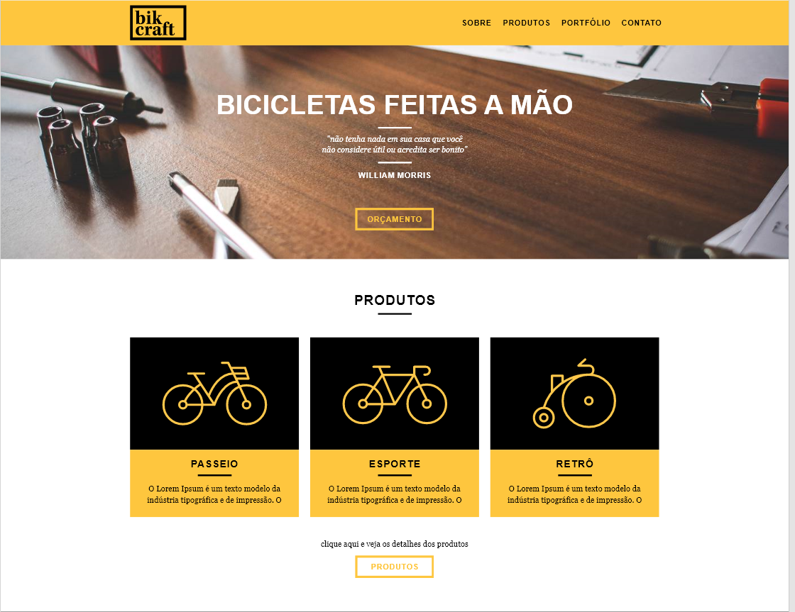
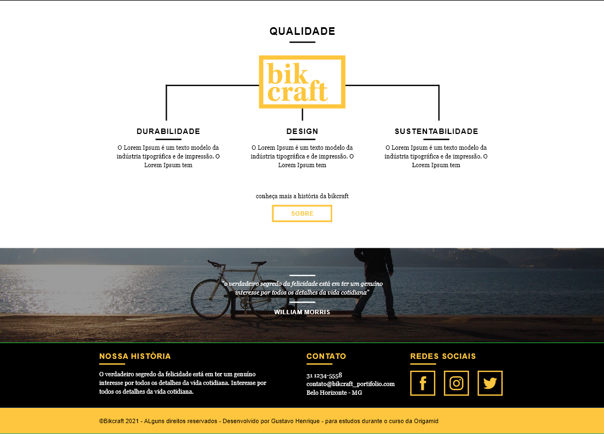

# Origamid-Projetos
 repository with adapted projects from the Origamid course

<h1> Progesso do primeiro Projeto Origamid - Bikcraft </h1>

 Segue as ultimas alterações realizadas durante o curso de desenvolmento Web da Origamid, tentei detalhar e deixar o mais rico o possivel visualmente.

    
<strong>
    Conhecimentos aprendidos e aplicados durante essa etapa
</strong>

  * HTML
  * CSS
  * UX/UI
  * Boas praticas
  * Teorias das cores e complementos
  * Padronização de estrutura

